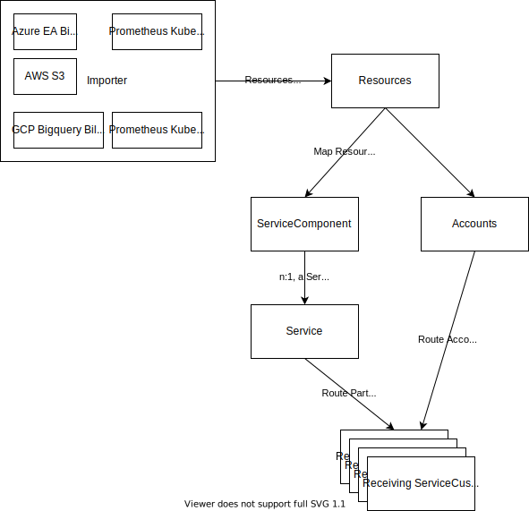

# Cloud Billing

This project aggregates the costs public cloud resources by accounts, services and tags by importing the invoices from public cloud providers and exporting their aggregates in CSV (or another format).
It can be used for internal service brokers and allows for aggregating account / subscription / project costs for aws, azure and gcp and additionally allows for tag based aggregation.

It can run as a container and can schedule jobs through kubernetes cronjobs for monthly imports and exports.

It is not a graphical tool to get a drill down view over all costs (such as Azure Cost Management) but rather glue code between cloud provider invoices and internal invoicing systems (such as csv files based system, although other formats could added).

# Sample Use Case
A team hosts a kubernetes service and an managed database on a public cloud provider, where multiple application teams run their apps. With this tool, cluster usage and databases can be imported and costs split between the app teams. Each app will be its own service and will receive its fair share of costs. Additionally, the platform team also receives an overview of their total costs. Billing setup is flexible and allows for fixed prices (e.g. each database price is X) and also flexible pricing based on tags and percentages (e.g. the cluster is invoiced for a resource with a tag plus a 10% fee for support).

# Features
* Multiple import options, amongst them azure, gcp and aws
* Hashicorp Vault Integration, read secrets from Hashicorp Vault
* Flexible billing with fixed prices and percentage-based prices
* Allows invoicing of projects without tags
* Informs service customers about service costs with a monthly email

# Architecture


# Install & Run
## Requirements
* python3
* pip
* virtualenv
* sqlite (or mysql for production)
* mariadb-client

## Install Requirements on Ubuntu
Some libraries for the DB connectors are required (mssql and mysql):
`sudo apt-get install mariadb-client libmariadbclient-dev unixodbc unixodbc-dev` 

## Install Python Packages Requirements
```
pip install -r requirements.txt
pip install -r requirements-test.txt
```

## Run locally with sqlite
```
# Import Sample Data from Azure from ./sample_files
python run.py -e env/dev.env import AzureImport -n azure

# Update Prices and Percentages
# Run command below and navigate to: http://localhost:5000/account/
python run.py -e ./env/dev.env run

# Export Accounts to local CSV and check the Azure.csv afterwards on the local filesystem
python run.py -e env/dev.env bill Azure -n bill_azure

# Update Services and attach them to a service customer
# Run below command and navigate to: http://localhost:5000/service/
# Set a a service customer in the service customer column and set a random string in the column left to it
python run.py -e ./env/dev.env run

# Now create an invoice csv file for the managed services and check the ManagedCloudServices.csv file on the local filesystem:
python run.py -e env/dev.env bill ManagedCloudServices -n bill_msc
```

## Run Tests and Coverage
Tests are run with pytest and pymock. See /src/tests and /conftest.py for setup.
```
pytest
coverage run --source ./src -m pytest
coverage report
```

# Configuration
Configuration is done within the env files in /env or through environment variables. Database settings are loaded in /src/settings.py.

# Deployment
Ideally in a kubernetes environment where cronjobs can be created automatically from the interface. A Dockerfile can be found in the repository.
Environment vars in ./env can also be added from configmaps within kubernetes.

See /k8s_manifests folder for sample deployment manifests. Setup is divided into:
* _ns (Namespace)
* _secret (Secrets for Connection to the Cloud Providers and the Mysql database)
* _configmap (Configuration Details)
* _deployment (Deployment of the app and ingresses and services)